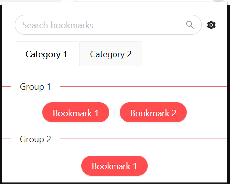

# Code Bookmarks Plugin

Code Bookmarks is a plugin for Google Chrome, that builds a popup with bookmarks from json file. Can be used within group of people to share their bookmarks by storing a specific .json file within source code.



## Installation

- Clone the repository
- Then build the project `npm run build`
- Open Chrome -> Extensions -> Load unpacked

## Usage

- Click on settings icon to load json file containing your bookmarks
- [Template](template.json) of how the file should be formatted:

```json
[
  {
    "category": "Category 1",
    "bookmarksGroups": [
      {
        "group": "Group 1",
        "bookmarks": [
          {
            "title": "Bookmark 1",
            "url": "https://www.google.pl",
            "tldr": "TLDR TLDR"
          },
          {
            "title": "Bookmark 2",
            "url": "https://www.google.pl",
            "tldr": "TLDR TLDR"
          }
        ]
      },
      {
        "group": "Group 2",
        "bookmarks": [
          {
            "title": "Bookmark 1",
            "url": "https://www.google.pl",
            "tldr": "TLDR TLDR"
          }
        ]
      }
    ]
  },
  {
    "category": "Category 2",
    "bookmarksGroups": [
      {
        "group": "Group 1",
        "bookmarks": [
          {
            "title": "Bookmark 1",
            "url": "https://www.google.pl",
            "tldr": "TLDR TLDR"
          },
          {
            "title": "Bookmark 2",
            "url": "https://www.google.pl",
            "tldr": "TLDR TLDR"
          }
        ]
      },
      {
        "group": "Group 2",
        "bookmarks": [
          {
            "title": "Bookmark 1",
            "url": "https://www.google.pl",
            "tldr": "TLDR TLDR"
          }
        ]
      },
      {
        "group": "Group 3",
        "bookmarks": [
          {
            "title": "Bookmark 1",
            "url": "https://www.google.pl",
            "tldr": "TLDR TLDR"
          }
        ]
      }
    ]
  }
]
```
